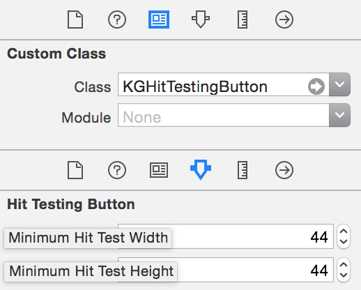

## Overview
**KGHitTestingViews** is a small helper library to effortlessly increase the hit test area of a view or a button. It's common to display buttons as small as 20 x 20 points. However, [iOS User Interface Guidelines](https://developer.apple.com/library/ios/documentation/UserExperience/Conceptual/MobileHIG/LayoutandAppearance.html) recommends that all tappable controls have at least a 44 x 44 point hit area. A common solution to this problem involves making a large button containing a small image, but this solution impacts positioning constraints relative to the small image and makes the layout generally more awkward. **KGHitTestingViews** aims to solve this problem in a simple manner.

## How to use

### In Code:
Subclass `KGHitTestingView` or `KGHitTestingButton` and set `minimumHitTestHeight` and `minimumHitTestWidth` to the desired size of the hit test area:

```
@interface ButtonSubclass : KGHitTestingButton
@end
```
```
- (void)setup {
	self.minimumHitTestWidth = 44.0;
	self.minimumHitTestHeight = 44.0;
}
```

### In Interface Builder:
Subclass `KGHitTestingView` or `KGHitTestingButton` and set the runtime attributes:


### Important note: 
The height and width of the hit test area are *minimums*. If you specify a smaller hit area width or height than what the bounds specify, the bounds width or height will be used.

## FAQ
###What is hit testing?

"The process of determining whether a user-controlled cursor (such as a mouse cursor or touch-point on a touch-screen interface) intersects a given graphical object (such as a shape, line, or curve) drawn on the screen." - [Wikipedia](http://en.wikipedia.org/wiki/Hit-testing)

###Why override `-pointInside:`? I thought this is hit testing.
Hit test (`-hitTest:`) is a more-complex algorithmic test that involves looping through subviews. Point inside (`-pointInside:`) is a simple geometric test which checks whether a `CGPoint` is within the bounds of a given view. For the purposes of increasing the touch area, we only need to modify the geometric calculation. For more, check out [this](http://smnh.me/hit-testing-in-ios/) nicely written blog about hit-testing.

## Credits
Created and maintained by Krisjanis Gaidis. 

## License
KGHitTestingViews is released under the MIT license. See LICENSE for details.